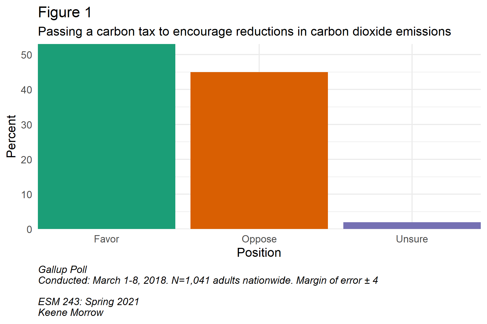

*Find a poll that asks questions relevant to your policy area. Write a paper (no more than 600 words) summarizing and analyzing the results of the survey. What do the results suggest about public opinion on your policy? Has public opinion been changing? How is this likely to play into policy outcomes in your policy area? Be prepared to tell the class about the survey findings.*

```{r setup, include=FALSE}
knitr::opts_chunk$set(echo = FALSE, include = FALSE)

library(tidyverse)
library(janitor)
library(here)
library(RColorBrewer)
library(lubridate)
```

```{r}
poll <- read.csv("poll.csv") %>% 
  janitor::clean_names()%>%
  rename("Too Much" = too_much,
         "Too Little" = too_little,
         "About Right" = about_right,
         Unsure = unsure)

poll_long <- poll %>%
  pivot_longer(cols = 4:7,
               names_to = "Position",
               values_to = "Percent")

years <- unique(poll$year)

ggplot(data = poll_long) +
  geom_area(aes(x = year,
                y = (100*Percent),
                fill = Position),
            alpha = 0.8) +
  geom_vline(aes(xintercept = 1992)) +
  geom_vline(aes(xintercept = 1996)) +
  geom_vline(aes(xintercept = 2000)) +
  geom_vline(aes(xintercept = 2004)) +
  geom_vline(aes(xintercept = 2008)) +
  geom_vline(aes(xintercept = 2012)) +
  geom_vline(aes(xintercept = 2016)) +
  scale_fill_brewer(palette = "Dark2") +
  scale_x_continuous(breaks = c(1992, 1996, 2000, 2004, 2008, 2012, 2016, 2018),
                     expand = c(0,0)) +
  scale_y_continuous(expand = c(0,0)) +
  labs(title = "Figure 2",
       subtitle = "Do you think the U.S. government is doing too much, too little,\nor about the right amount in terms of protecting the environment?",
       x = "Year",
       y = "Percent",
       caption = "Gallup Poll\nLast Conducted: March 1-8, 2018. N=1,041 adults nationwide. Margin of error ± 4\nPoll Years: 1992, 2000, 2003, 2004, 2005, 2006, 2010, 2011, 2012, 2013, 2018\n\nVertical lines indicate presidential election years.\n\nESM 243: Spring 2021\nKeene Morrow") +
  theme_minimal() +
  theme(plot.caption = element_text(hjust = 0, face = "italic"))

ggsave(here::here("figures","figure2.png"), width = 6, height = 4)
```

```{r}
carbon <- read.csv("carbon_long.csv") %>% 
  janitor::clean_names()

ggplot(data = carbon) +
  geom_col(aes(x = position,
               y = percent,
               fill = position),
           show.legend = FALSE) +
  scale_fill_brewer(palette = "Dark2") +
  scale_x_discrete(expand = c(0,0)) +
  scale_y_continuous(expand = c(0,0)) +
  labs(title = "Figure 1",
       subtitle = "Passing a carbon tax to encourage reductions in carbon dioxide emissions",
       x = "Position",
       y = "Percent",
       caption = "Gallup Poll\nConducted: March 1-8, 2018. N=1,041 adults nationwide. Margin of error ± 4\n\nESM 243: Spring 2021\nKeene Morrow") +
  theme_minimal() +
  theme(plot.caption = element_text(hjust = 0, face = "italic"))

ggsave(here::here("figures","figure1.png"), width = 6, height = 4)
```


```{r}
ind <- read.csv("env_vs_ind.csv") %>% 
  janitor::clean_names()%>%
  rename("Protection of the Environment" = env,
         "Development of Energy Supplies" = dev,
         "Equally / Both (volunteered)" = equal,
         "Neither / Other (volunteered)" = neither,
         Unsure = unsure)

ind_long <- ind %>%
  pivot_longer(cols = 3:7,
               names_to = "Priority",
               values_to = "Percent") %>%
  mutate(end = ymd(as_date(end_date)))

ggplot(data = ind_long) +
  geom_area(aes(x = year,
                y = (Percent),
                fill = Priority),
            alpha = 0.8) +
  geom_vline(aes(xintercept = 2004)) +
  geom_vline(aes(xintercept = 2008)) +
  geom_vline(aes(xintercept = 2012)) +
  geom_vline(aes(xintercept = 2016)) +
  scale_fill_brewer(palette = "Dark2") +
  scale_x_continuous(breaks = c(2004, 2008, 2012, 2016, 2018),
                     expand = c(0,0)) +
  scale_y_continuous(expand = c(0,0)) +
  labs(title = "Figure 3",
       subtitle = "With which one of these statements about the environment and energy production do you\nmost agree? Protection of the environment should be given priority, even at the risk of limiting\nthe amount of energy supplies -- such as oil, gas and coal -- which the United States produces.\nOR, Development of U.S.n energy supplies -- such as oil, gas and coal -- should be given priority,\neven if the environment suffers to some extent",
       x = "Year",
       y = "Percent",
       caption = "Gallup Poll\nLast Conducted: March 1-8, 2018. N=1,041 adults nationwide. Margin of error ± 4\nPoll Years: 2001, 2002, 2003, 2004, 2005, 2006, 2007, 2008, 2009, 2010, 2011, 2012, 2013, 2018\n\nVertical lines indicate presidential election years.\n\nESM 243: Spring 2021\nKeene Morrow") +
  theme_minimal() +
  theme(plot.caption = element_text(hjust = 0, face = "italic"))

ggsave(here::here("figures","figure3_area.png"), width = 6, height = 4)

ind_filter <- read.csv("env_vs_ind.csv") %>% 
  janitor::clean_names() %>%
  select(year, env, dev) %>% 
  rename("Protection of the Environment" = env,
         "Development of Energy Supplies" = dev) %>%
  pivot_longer(cols = 2:3,
               names_to = "Priority",
               values_to = "Percent")

ggplot(data = ind_filter) +
  geom_line(aes(x = year,
                y = Percent,
                color = Priority),
            size = 0.8) +
  geom_vline(aes(xintercept = 2004)) +
  geom_vline(aes(xintercept = 2008)) +
  geom_vline(aes(xintercept = 2012)) +
  geom_vline(aes(xintercept = 2016)) +
  scale_color_brewer(palette = "Dark2") +
  scale_x_continuous(breaks = c(2004, 2008, 2012, 2016, 2018),
                     expand = c(0,0)) +
  scale_y_continuous(expand = c(0,0)) +
  labs(title = "Figure 3",
       subtitle = "With which one of these statements about the environment and energy production do you\nmost agree? Protection of the environment should be given priority, even at the risk of limiting\nthe amount of energy supplies -- such as oil, gas and coal -- which the United States produces.\nOR, Development of U.S. energy supplies -- such as oil, gas and coal -- should be given priority,\neven if the environment suffers to some extent",
       x = "Year",
       y = "Percent",
       caption = "Gallup Poll\nLast Conducted: March 1-8, 2018. N=1,041 adults nationwide. Margin of error ± 4\nPoll Years: 2001, 2002, 2003, 2004, 2005, 2006, 2007, 2008, 2009, 2010, 2011, 2012, 2013, 2018\n\nVertical lines indicate presidential election years.\n\nESM 243: Spring 2021\nKeene Morrow") +
  theme_minimal() +
  theme(plot.caption = element_text(hjust = 0, face = "italic"))

ggsave(here::here("figures","figure3_line.png"), width = 8, height = 5)
```

In a March 2018 Gallup poll, 53% of the 1,041 respondents indicated that they were in favor of "passing a carbon tax to encourage reductions in carbon dioxide emissions." (Figure 1, Gallup 2018)



While Gallup had not previously polled on this question, it and several others on potential government  environmental policies were added as part of an ongoing poll. That poll was started in 1992 and asked participants how they felt the US federal government was doing in its response to environmental issues (Figure 2) and, starting in 2001, whether the federal government should prioritize environmental protection or energy production (Figure 3).


**References**

Editor. 2017. “US Republican idea for tax on carbon makes climate sense: A conservative solution to global warming.” Nature 542, 271–272, 16 February. doi:10.1038/542271b

Gallup. 2018. "Americans' Views on Environmental, Energy Policies (Trends)" https://news.gallup.com/poll/232016/americans-views-environmental-energy-policies-trends.aspx

Martin, R et al. 2014. “The impact of a carbon tax on manufacturing: evidence from microdata.” Journal of Public Economics, 117, 1-14. https://doi.org/10.1016/j.jpubeco.2014.04.016

Rott, Nathan. 2021. “Biden Moves to Have U.S. Rejoin Climate Accord. National Public Radio (NPR). https://www.npr.org/sections/inauguration-day-live-updates/2021/01/20/958923821/biden-moves-to-have-u-s-rejoin-climate-accord

Stiglitz, J. E. & Stern, N. 2017. Report of the High-Level Commission on Carbon Prices. World Bank.

Ye, Jason. 2020. “Carbon Pricing Proposals in the 116th Congress.” Center for Climate and Energy Solutions.
